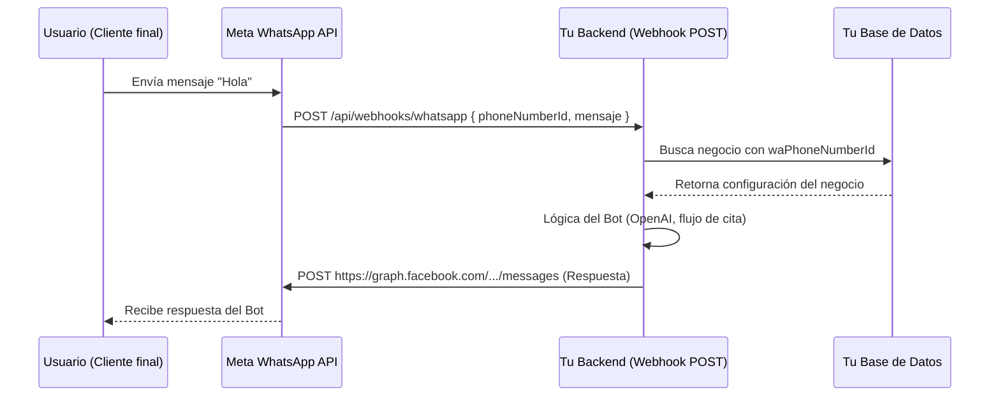

# Plano Arquitectónico: Migración a Meta WhatsApp Cloud API

Para que la aplicación escale a cientos o miles de negocios (multi-tenant) sin problemas, debemos pasar de un modelo de "Bots en Memoria" (Stateful) a un modelo de "Eventos en Servidor" (Stateless HTTP).

A continuación se presenta el **Blueprint** completo para realizar este rediseño estructural.

---

## 1. El Nuevo Flujo del Usuario (UI/UX)

La experiencia del usuario final (dueño del negocio) cambia drásticamente. Dejamos de pedirle que escanee un código QR y lo llevamos a un flujo de registro empresarial.

### **Antes (Baileys):**
1. Negocio hace click en "Conectar WhatsApp".
2. Se genera un código QR.
3. El dueño saca su teléfono, abre WhatsApp y lo escanea.

### **Ahora (Meta Cloud API):**
1. Negocio hace click en **"Conectar con WhatsApp Oficial"**.
2. Se abre un popup de Facebook (Flujo de *Embedded Signup*).
3. El dueño inicia sesión con Facebook, crea o vincula su cuenta de WhatsApp Business (WABA) y verifica su negocio.
4. El popup se cierra. Nuestra UI recibe un permiso temporal de Facebook.
5. El frontend envía este permiso al backend, quien lo valida y almacena los IDs y Tokens necesarios para ese negocio.

> [!TIP]
> **Ventaja UI:** Esto le da a tu SaaS una apariencia sumamente corporativa y profesional, alineada con las aplicaciones modernas.

---

## 2. Cambios en la Base de Datos (Prisma)

El modelo de datos debe reflejar las credenciales de la API de Meta y deshacerse del rastro de Baileys.

### A. Eliminar Modelos Obsoletos
```diff
- model BaileysSession {
-   id    String @id
-   creds String @db.Text
-   keys  String @db.Text
- }
```

### B. Ampliar el Modelo `Negocio`
Debemos almacenar los identificadores únicos que Facebook asigna a cada empresa.
```prisma
model Negocio {
  // ... campos actuales ...
  
  // -- Nuevos campos para WhatsApp Cloud API --
  waAccessToken     String?   // Token de acceso de largo plazo para enviar mensajes
  waPhoneNumberId   String?   @unique // El ID del número desde donde enviaremos mensajes
  waWabaId          String?   // WhatsApp Business Account ID
  waAppId           String?   // (Opcional) Si manejas múltiples Meta Apps en el futuro
  isWaConnected     Boolean   @default(false)
}
```

### C. Actualizar `MensajeChat` (Trazabilidad)
Meta entrega recibos de lectura (enviado, entregado, leído) a través de los webhooks utilizando identificadores únicos de mensajes.
```prisma
model MensajeChat {
  // ... campos actuales ...
  waMessageId  String?  @unique // ID provisto por Meta (wamid.XXXXX)
  estadoEntrega String? @default("enviado") // entregado, leido, fallido
}
```

---

## 3. Nueva Arquitectura de Backend (Stateless)

El cambio más importante. Pasamos de tener conexiones pesadas en memoria a simples rutas HTTP y un único Webhook que "atrapa" todos los mensajes de todos tus clientes.



### A. El Webhook Maestro
Crearemos una ruta `POST /api/webhooks/whatsapp`. Meta enviará un JSON a esta ruta cada vez que CUALQUIER persona escriba al número de CUALQUIERA de tus clientes.
Tu backend analizará el JSON, extraerá el `phone_number_id` de destino, buscará a qué `Negocio` pertenece en la BD, y procesará la lógica del bot.

### B. Envío de Mensajes
Eliminaremos la función actual de enviar a través del socket y crearemos un servicio `metaGraph.service.ts`:
```typescript
async function enviarMensajeMeta(telefonoDestino: string, texto: string, negocio: Negocio) {
   await axios.post(
      `https://graph.facebook.com/v19.0/${negocio.waPhoneNumberId}/messages`,
      {
         messaging_product: "whatsapp",
         to: telefonoDestino,
         type: "text",
         text: { body: texto }
      },
      { headers: { Authorization: `Bearer ${negocio.waAccessToken}` } }
   );
}
```

---

## 4. Retos y Soluciones a Largo Plazo (Scale)

1. **Reto: Regla de las 24 Horas**
   - *Problema:* Meta no permite enviar mensajes promocionales/libres si han pasado más de 24 horas desde que el usuario escribió por última vez.
   - *Solución:* Tu backend debe validar que el último mensaje (`SesionChat.ultimoMensaje`) es menor a 24h. Si es mayor, debes enviarle una **Plantilla preaprobada (Template)** (ej: recordatorio de cita). Tu DB y UI deben permitir que los negocios sincronicen sus plantillas aprobadas.
   
2. **Reto: Tiempo de respuesta del Webhook**
   - *Problema:* Si tu bot se demora más de unos segundos en responder (por consultar ChatGPT o BD lentas), Meta asume que tu Webhook falló y volverá a enviar el mismo mensaje (retries).
   - *Solución (Futuro):* Procesar los mensajes con colas asíncronas (RabbitMQ o Redis/BullMQ). El Webhook recibe el mensaje, responde "200 OK" a Meta instantáneamente, y manda la lógica de IA/Citas a procesarse en segundo plano.

3. **Reto: Costos por Plantillas**
   - *Problema:* Aunque los mensajes entrantes (User-initiated) te dan 24 horas gratis, si envías una plantilla para un recordatorio de cita, Meta te cobra unos centavos.
   - *Solución:* La plataforma SaaS debe poder trasladar estos costos al Negocio, o limitarlos según el "Plan" (`PRO`, `FREE`). Necesitas un sistema para medir cuántas conversaciones / plantillas consume cada Negocio.
